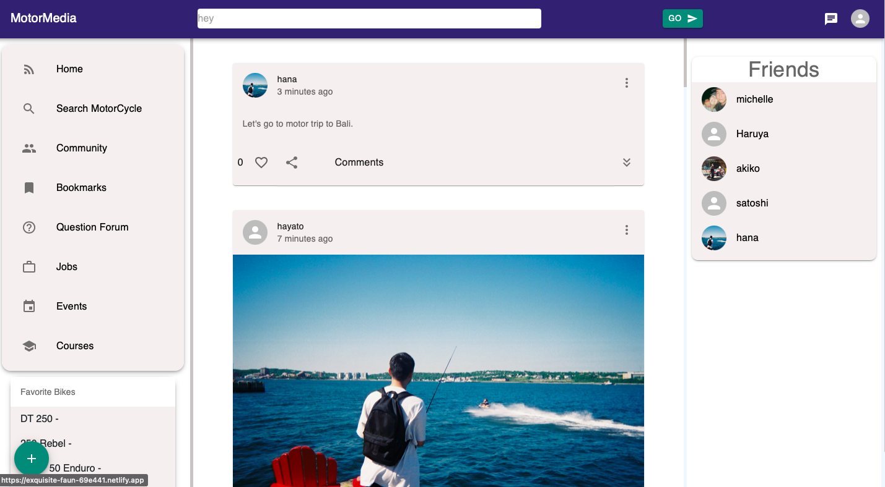
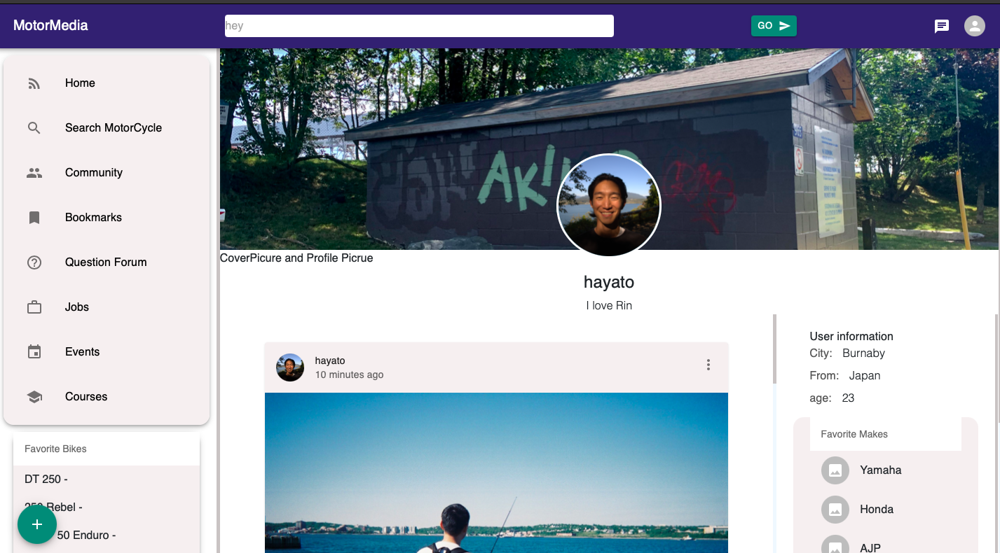
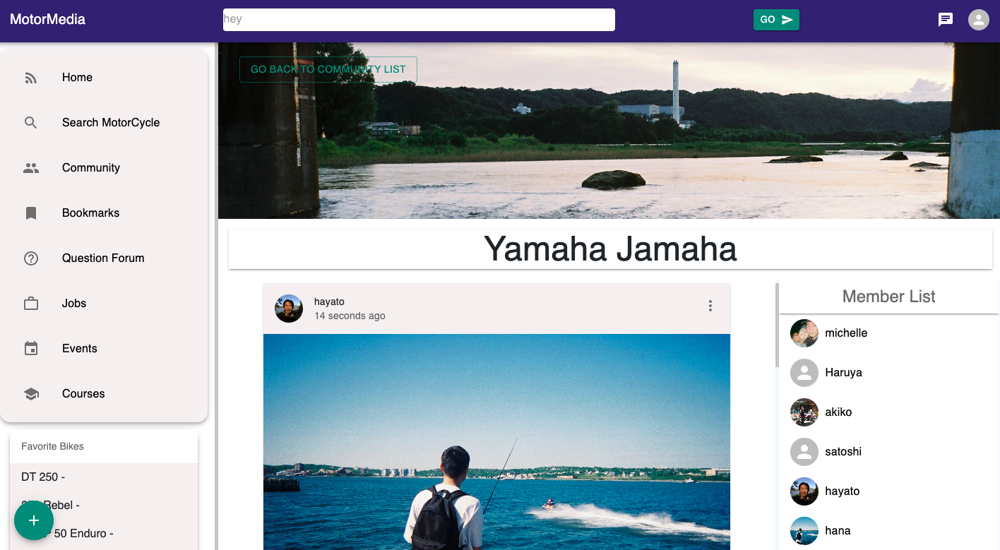
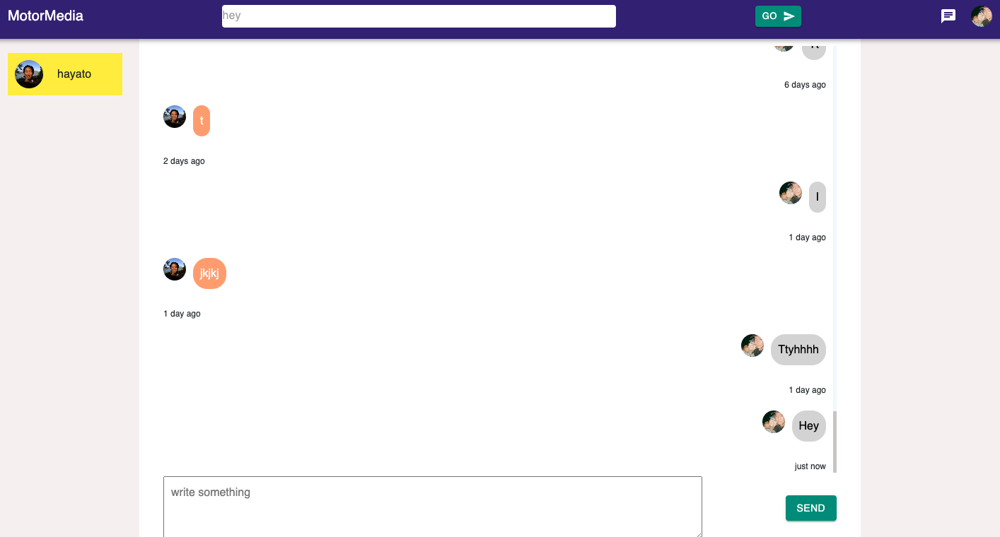
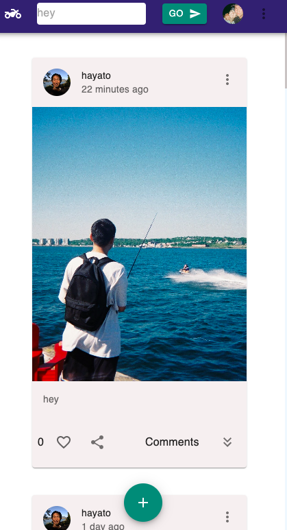
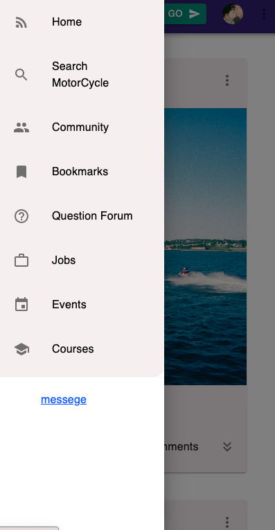
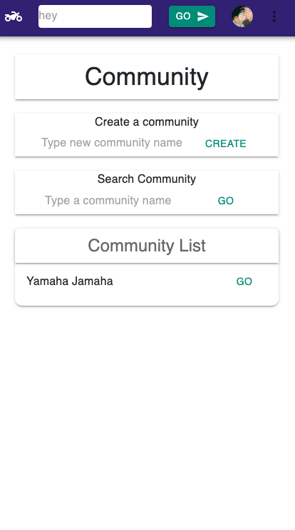
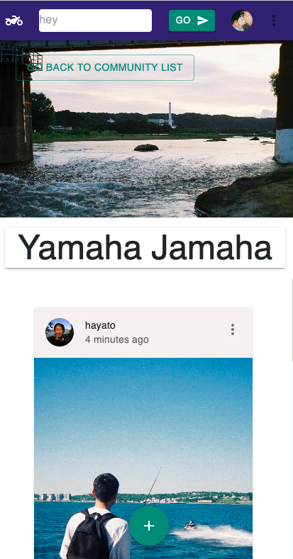
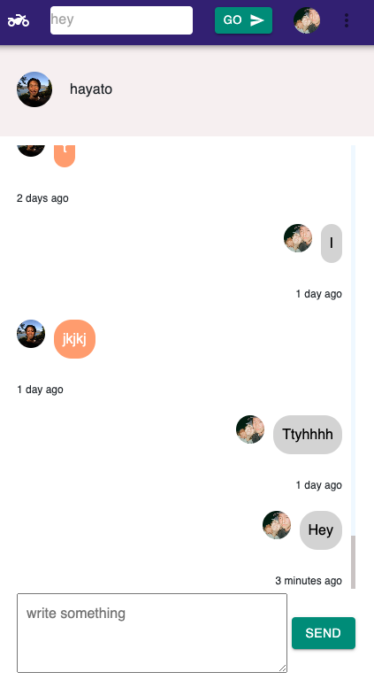
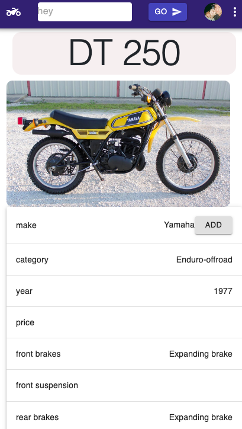

# Motor Media
> Social Media for Motor Cycle Enthusiasts to explore people, communities, events, jobs and many more.
> Website Link [Website](https://cheerful-fairy-1eee98.netlify.app/) (having an issue with CORS policy on the server side, and I'm working on it.)

## Table of Contents
* [General Info](#general-information)
* [Features](#features)
* [Motivation](#motivation--what-problem-does-it-intend-to-solve?)
* [Technologies Used](#technologies-used)
* [Screenshots](#screenshots)
* [Project Status](#project-status)
* [Room for Improvement](#room-for-improvement)
* [Acknowledgements](#acknowledgements)
* [Contact](#contact)
<!-- * [License](#license) -->
<!--
* [Setup](#setup)
* [Usage](#usage)
-->
<!--  what is it? for what ? and how??  -->
## General Information
- Social media that is designed to help motorcyclists feel connected and cultivate their interest at the fullest degree all at once.
- Find people that you like, connect with communities of certain interests, and share your experiences with your favorite motorcycle. 
- Ask questions to people who have been riding the motor cycle you have been wanting to buy, and you can go to motorcycle trip with them.

<!-- what to say? chat, connect with community, search motorcycle and connect with people who has those. find jobs, host an event, provide some courses -->
## Features
- Share your thoughts with photos
- Craete/join a community with a specific interest
- Real time chat with friends
- Browse motorcycles from motorcycle database(more than 35,000 moto models)
- Register your favorite/owned/wishList motorcycle, so that people can see it to connect with you.
- Find jobs in motor cycle industry
- Host an event
- Provide/take motor cycle courses
- Fully responsive from Desktop to Mobile screen with Material-ui responsive design.

## Motivation - what problem does it intend to solve?

> 1. To make users feel more connected by having smaller communities
- Nowadays almost all the social media(instagram, FB, snapchat etc) are too big, too broad, too much of distruction. This application specifically focuses on motorcyclists, to make community size smaller to let people feel more connected(too big community is difficult to manage, feel connected and engage in .)
> 2. To reduce any commercial distruction as much as possible, to serve users
-   I want the purpose of a social media to be connecting people and making them feel secure, belong to a community, instead of tricking users brains and behaviors to make them buy stuff).  

> Why did I undertake it?
- Because personally I have not been a fun of huge social media out there(instagram, facebook, snapchat etc) as their way of maximizing their company seems to be making users hooked with their services by attention-engineering, and I think it has been really challenging problem for any generations especially younger ones. Therefore I wanted to make a social media that merely serves them, intead of using their attention.
<!-- You don't have to answer all the questions - just the ones relevant to your project. -->

## Technologies Used
- React.js - version 18.1.0
- Node.js - version 15.x
- socket.io - version 4.5.1
- MongoDB 
- MUI

## DESKTOP Screenshots
HOME PAGE

PROFILE PAGE

COMMUNITY PAGE

REAL TIME CHAT PAGE

SEARCH MOTORCYCLE PAGE

## MOBILE  Screenshots
HOME PAGE

HOME PAGE SIDE BAR

COMMUNITY LIST PAGE

COMMUNITY PAGE

REAL TIME CHAT PAGE

SEARCH MOTORCYCLE PAGE

<!-- If you have screenshots you'd like to share, include them here. -->

<!--
## Setup
What are the project requirements/dependencies? Where are they listed? A requirements.txt or a Pipfile.lock file perhaps? Where is it located?

Proceed to describe how to install / setup one's local environment / get started with the project.

## Usage
How does one go about using it?
Provide various use cases and code examples here.

`write-your-code-here`
-->

## Project Status
Project is: _in progress_ .

## Room for Improvement
Room for improvement:
- Events page under construction
- Courses page under construction
- Bookmark page under construction
- Question Forum page under construction
- Jobs page under construction
- Shift to TypeScript

## Acknowledgements
- This project was inspired by [React Node.js Social Media App Tutorial](https://www.youtube.com/watch?v=pFHyZvVxce0&t=4961s).

## Contact
Created by [@HayatoKoyama](https://github.com/Hayato0512) - feel free to contact me at khayato0512.canada@gmail.com 

<!-- Optional -->
<!-- ## License -->
<!-- This project is open source and available under the [... License](). -->

<!-- You don't have to include all sections - just the one's relevant to your project -->
